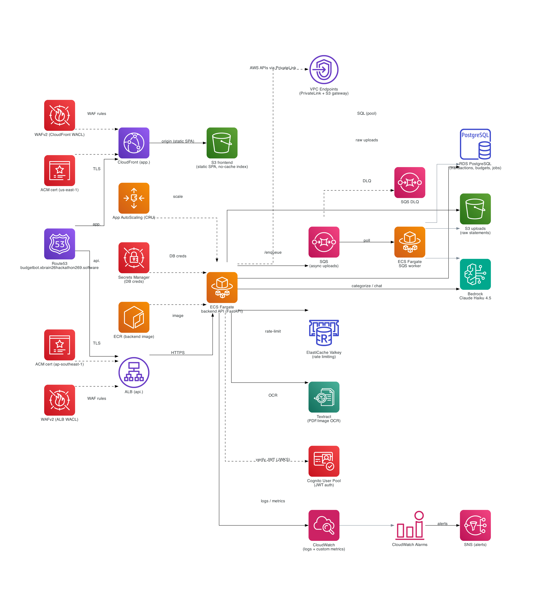
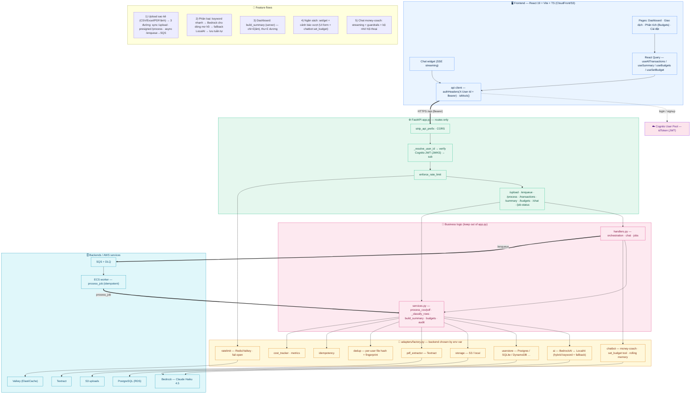
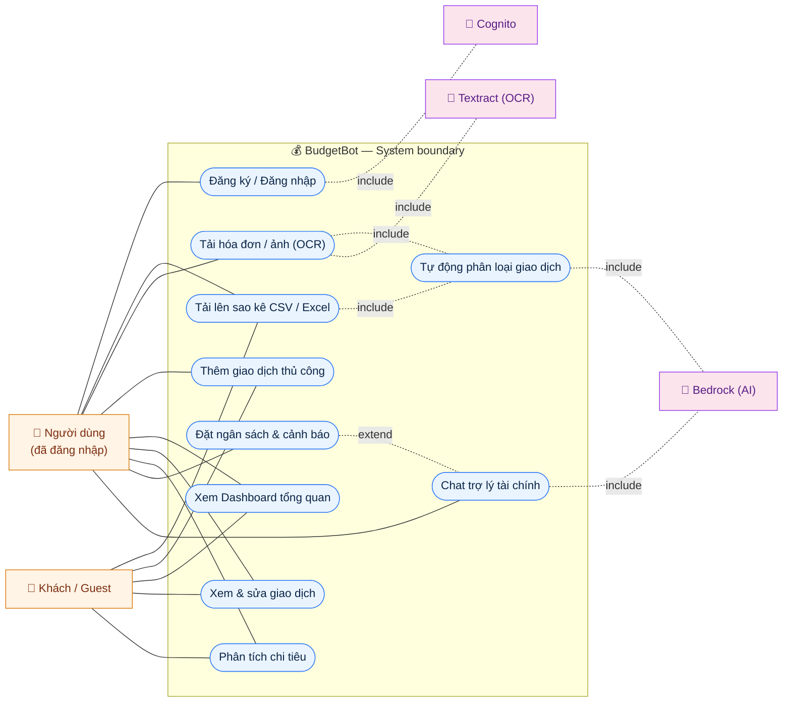
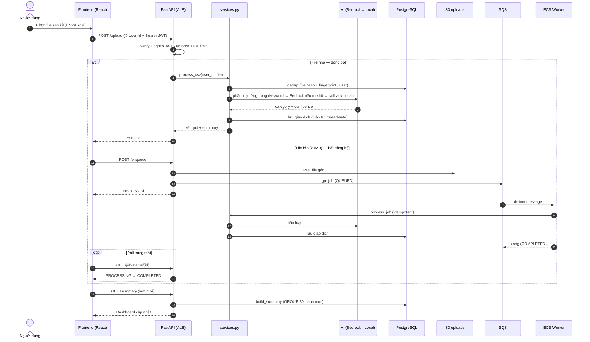
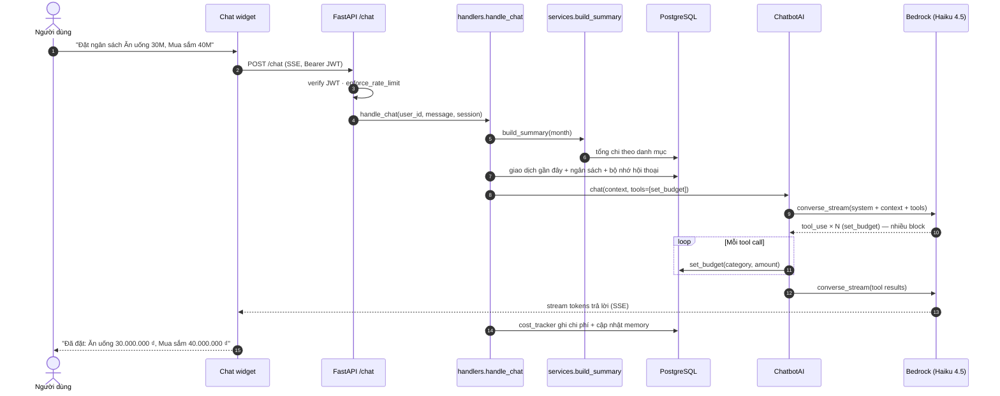

# BudgetBot — AI Money Coach

Upload a bank statement (CSV / Excel / PDF) or a bank-transfer screenshot → every
transaction is **categorized by AI** → spending is summarized by category, with
budgets, alerts, and a streaming **AI money-coach chatbot**.

Designed to run **fully locally** (rule-based stub, SQLite, filesystem) and flip to
AWS (Bedrock, S3, Postgres/DynamoDB, Cognito) **via env vars alone — no code changes**.

---

## Quick start (local, ~2 minutes)

### Backend

```bash
make install                 # python venv + pip install -r requirements.txt
cp .env.example .env         # local defaults: AI=local, storage=local, db=sqlite
make run                     # uvicorn src.app:app --reload --port 8000
```

```bash
# health check
curl http://localhost:8000/health

# end-to-end: upload a sample statement, then read the summary
curl -X POST http://localhost:8000/upload \
  -H "X-User-Id: alice" \
  -F "file=@sample_data/bank_statement_q2_2026.csv"

curl "http://localhost:8000/summary?month=2026-04" -H "X-User-Id: alice"
```

With the local defaults there are **no AWS calls**: categorization uses keyword
rules, uploads go to `data/uploads/`, and transactions land in SQLite at
`./_data/transactions.db`.

### Frontend

```bash
cd frontend
pnpm install
pnpm dev                     # Vite dev server → http://localhost:5173
```

The dev server proxies `/api` → `http://localhost:8000`, so run the backend too.
React 19 + Vite + Tailwind v4 + Recharts + React Query. Bilingual (VN primary / EN),
light + dark, mobile-first.

### Tests

```bash
make test                                  # pytest -v tests/
pytest tests/test_smoke.py::test_health -v # single test
```

Tests force local backends at import time — they never touch AWS.

---

## Features

- **Four ways to add transactions**, all converging on one categorize-and-save core:
  - **CSV / Excel statements** (`.csv`, `.xlsx`, `.xls`) — auto-detects the Date /
    Description / Amount columns (or Debit/Credit) by header synonyms, no per-bank code.
  - **Receipt images & PDFs** (`.png`, `.jpg`, `.webp`, `.pdf`) — a single vision
    prompt reads bank-transfer screenshots from any bank (VCB, Techcombank, MB, MoMo…).
  - **Manual quick-add** — one transaction at a time; AI suggests the category.
- **AI categorization** into 10 canonical categories: `Food, Transport, Shopping,
  Bills, Entertainment, Health, Education, Salary, Transfer, Other`. Vietnamese input
  is mapped via aliases. (Source of truth: `src/categories.py`, mirrored in
  `frontend/src/lib/categories.ts`.)
- **Deduplication** — 4-level: same-file re-upload (skip / replace / append), and a
  fingerprint + date-tolerance check that warns on near-duplicate rows.
- **Summaries, budgets & alerts** — spend by category, top drivers, per-category
  budget limits with over-budget warnings.
- **AI money-coach chat** — streaming (SSE), domain-guardrailed, with a `set_budget`
  tool and rolling conversation memory.
- **Auth** — AWS Cognito (email sign-up / verify / login / forgot-password) with a
  **"continue as guest"** option. Runs guest-only when Cognito env vars are unset.
- **Cost instrumentation** — token usage and USD cost tracked per request
  (`GET /admin/cost-report`), CloudWatch custom metrics in `BudgetBot/W7`.

---

## Architecture

Strictly layered — **business logic stays out of `app.py`**:

```
app.py        routes, HTTP concerns, user_id resolution
  └─ handlers.py     parsing, the categorize-and-save pipeline, summaries, budgets, chat
       └─ adapters/  pluggable backends, chosen by factory.py from env vars
```

The same `src.app:app` runs under **uvicorn** locally, **ECS Fargate** (`Dockerfile.web`),
and **AWS Lambda** (Mangum `handler`, `Dockerfile`). The Lambda handler routes SQS
`Records` to the async worker and everything else to Mangum.

### Adapters — swap purely by env var

| Concern | Env var | Options | Local default |
|---|---|---|---|
| AI categorization/chat | `AI_BACKEND` | `bedrock`, `local` | `local` |
| Receipt/PDF extraction | `PDF_BACKEND` | `bedrock`, `local` | `local` |
| Object storage (uploads) | `STORAGE_BACKEND` | `s3`, `local` | `local` |
| Transaction DB | `USERSTORE_BACKEND` | `sqlite`, `postgres`, `dynamodb`, `documentdb`, `mysql` | `sqlite` |

`adapters/factory.py` is the **only** place backends are chosen. Adding a backend =
implement the documented interface + add one branch there.

`BedrockAI` is hybrid: fast keyword matching first, Bedrock `converse` only for
ambiguous rows, and **falls back to `LocalAI` on any Bedrock error** — so a missing
model or throttle never breaks an upload.

### API surface

```
GET  /health
POST /upload                 multipart CSV / Excel
POST /upload-pdf | /upload-image | /upload-receipt
POST /transaction            PUT/DELETE /transaction/{id}
GET  /transactions           DELETE /transactions
GET  /summary?month=YYYY-MM
GET  /budgets                POST /budgets
POST /chat                   POST /chat/reset       (streaming money coach)
GET  /admin/cost-report
```

`user_id` resolves from the Cognito JWT `sub` (API Gateway authorizer claims) →
`X-User-Id` header → `DEFAULT_USER_ID`. The SPA sends the Cognito `sub` (or a
`guest-…` id) as `X-User-Id`, so data scopes per user with no backend change.

**Domain conventions:** negative amount = expense, positive = income; budget "spent"
uses `abs()` of negatives. Currency assumed VND in the local stub; Bedrock is
currency-agnostic.

---

## Diagrams

Source files live in [`docs/diagrams/`](docs/diagrams/). The Mermaid blocks below
render natively on GitHub; the infrastructure diagram is also exported as a
high-DPI PNG and a **[vector PDF](docs/diagrams/budgetbot_-_aws_infrastructure.pdf)**
for crisp printing. To re-render any Mermaid file, paste it into
[mermaid.live](https://mermaid.live) or run
`npx -p @mermaid-js/mermaid-cli mmdc -i docs/diagrams/<name>.mmd -o <name>.svg`.

### Infrastructure (AWS)



Route53 splits traffic to **CloudFront → S3** (static SPA) and **ALB → ECS Fargate**
(API), both fronted by **WAFv2**. The API runs in private subnets, reaches AWS
services over **VPC endpoints (PrivateLink)**, and uses **RDS PostgreSQL**,
**ElastiCache (Valkey)** for rate limiting, **Bedrock** + **Textract** for AI/OCR,
**SQS (+DLQ)** with a worker service for async uploads, and **Cognito** for auth.
CloudWatch alarms fan out to SNS; app-autoscaling tracks CPU.

### Application architecture (by layer & feature)

[`docs/diagrams/app_architecture.mmd`](docs/diagrams/app_architecture.mmd)



### Use case (actors ↔ use cases)

[`docs/diagrams/usecase.mmd`](docs/diagrams/usecase.mmd)



### Sequence — statement upload & categorization

[`docs/diagrams/seq_upload.mmd`](docs/diagrams/seq_upload.mmd)



### Sequence — chat money-coach & budget

[`docs/diagrams/seq_chat.mmd`](docs/diagrams/seq_chat.mmd)



---

## Switching to AWS (env flip, no code change)

```diff
- AI_BACKEND=local
+ AI_BACKEND=bedrock
+ AI_MODEL_ID=global.anthropic.claude-haiku-4-5-20251001-v1:0
+ PDF_BACKEND=bedrock

- STORAGE_BACKEND=local
+ STORAGE_BACKEND=s3
+ STORAGE_BUCKET=budgetbot-statements-<accountid>

- USERSTORE_BACKEND=sqlite
+ USERSTORE_BACKEND=postgres          # OR dynamodb
+ USERSTORE_POSTGRES_URL=postgresql://user:pw@your-rds-endpoint:5432/budgetbot
```

For DynamoDB, set `USERSTORE_TABLE=…` (single-table: `PK=user_id`,
`SK=TXN#… / BUDGET#…`). Aggregations there need Scan/GSI; SQL backends do
`GROUP BY` natively — this trade-off is intentional.

Optional DB drivers (DocumentDB / MySQL / `psycopg2`): `pip install -r requirements-optional.txt`.

---

## Deploy to AWS (Terraform)

A full IaC stack lives in `terraform/` — ECS Fargate + EFS (SQLite persistence),
ALB + ACM, CloudFront + S3 (frontend), Cognito User Pool, and Route 53. State is in
S3 with native locking.

```bash
cd terraform
./bootstrap.sh                 # one-time: create the S3 state bucket
terraform init
terraform apply                # provision the stack
../terraform/deploy.sh all     # build+push backend image, publish frontend
```

`deploy.sh` bakes the Cognito outputs into the static frontend build automatically.
See **`terraform/README.md`** and **`DEPLOY.md`** for details, and **`CHANGES.md`**
for the v0.1 → v0.2 changelog.

Tear everything down with `terraform destroy`.

---

## Project layout

```
src/
├── app.py              FastAPI routes + Lambda handler
├── handlers.py         all business logic (parse, categorize, summarize, chat)
├── config.py           frozen env-driven settings
├── categories.py       canonical category enum + VN aliases
├── statement_parser.py CSV / Excel parsing (header auto-detect)
├── dedup/              normalization + dedup service
├── cost_tracker.py     token → USD cost accounting
├── metrics.py          CloudWatch custom metrics
└── adapters/
    ├── ai.py           BedrockAI (hybrid) | LocalAI (keyword rules)
    ├── chatbot.py      ChatbotAI streaming money coach
    ├── pdf_extractor.py receipt/PDF vision extraction
    ├── storage.py      S3Storage | LocalStorage
    ├── userstore.py    sqlite/postgres/dynamodb/documentdb/mysql + jobs + chat memory
    └── factory.py      env → adapter selection
frontend/               React 19 + Vite + Tailwind v4 SPA
terraform/              ECS/ALB/CloudFront/Cognito/Route53 IaC
docs/diagrams/          architecture diagrams (Mermaid .mmd + infra PNG/PDF)
sample_data/            sample CSV / PDF / receipt images
scripts/                cost estimate, AI accuracy eval, seed/init DB, smoke
tests/                  pytest (local backends only)
```

---

## Sample data

```
sample_data/bank_statement_q2_2026.csv   full statement
sample_data/smoke_test_5_rows.csv        tiny smoke file
sample_data/bank_statement_sample.pdf    PDF statement
sample_data/sample_receipts/             transfer-screenshot images
```

CSV format — header row optional:

```
date,description,amount
2026-04-02,Highlands Coffee - Bui Vien,-65000
2026-04-04,Salary deposit credit,18500000
```

Negative = expense, positive = income.
